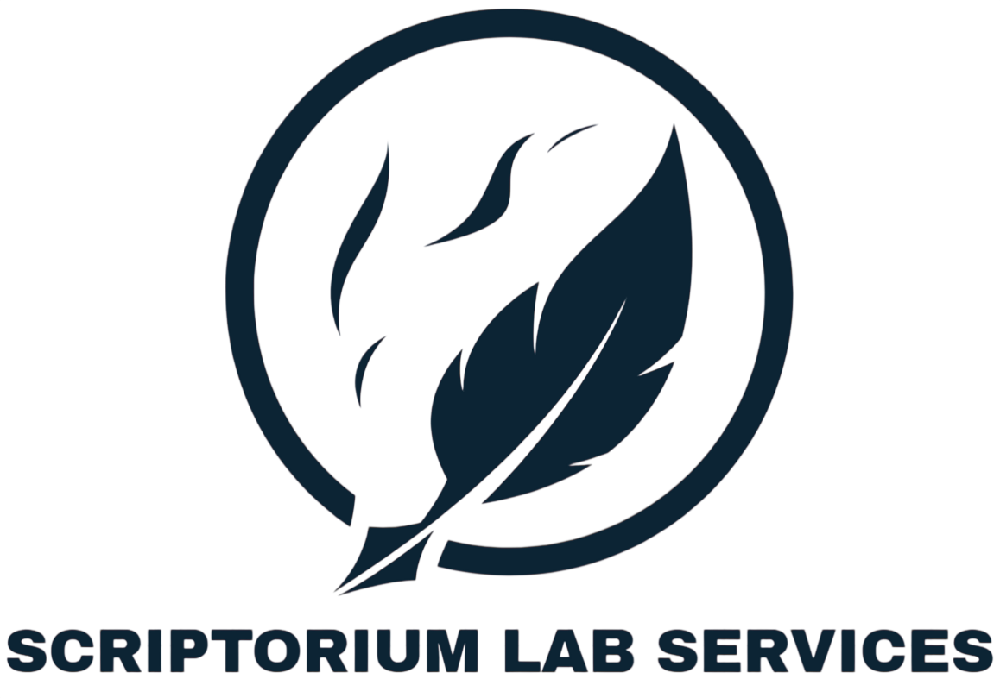

<section class="home-hero" aria-labelledby="home-title">
  

    

      
      
Enterprise documentation center

      <h1 id="home-title">Scriptorium Lab Services documentation</h1>
      

        Build, review, govern, and publish trustworthy documentation through a practical Docs-as-Code workflow.
      

      

        <a class="home-action home-action--solid" href="guides/01-clean-product-overview/">Start with a guide</a>
        <a class="home-action" href="https://github.com/harjotdhodi-gif/AI-Docs-as-Code-MKDocs">Open the GitHub repository</a>
      

    

    <nav class="home-pillars" aria-label="Documentation pathways">
      <a class="home-pillar" href="guides/install/">
        <strong>Start</strong>
        Install the documentation toolchain and understand the repository structure.
      </a>
      <a class="home-pillar" href="guides/01-clean-product-overview/">
        <strong>Develop</strong>
        Create clear, structured, and reusable technical content in Markdown.
      </a>
      <a class="home-pillar" href="guides/review-workflow/">
        <strong>Govern</strong>
        Use Vale, AI review, Pull Requests, and human approval controls.
      </a>
      <a class="home-pillar" href="downloads/">
        <strong>Publish</strong>
        Deliver approved documentation as HTML, PDF, and Word files.
      </a>
    </nav>

    <aside class="home-updates" aria-labelledby="updates-title">
      <h2 id="updates-title">Explore</h2>
      <ul>
        <li>
          <a href="tags/">Browse documentation by tag</a>
          <small>Content discovery</small>
        </li>
        <li>
          <a href="abbreviations/">Open abbreviations and glossary</a>
          <small>Terminology reference</small>
        </li>
        <li>
          <a href="downloads/">Access generated downloads</a>
          <small>PDF and DOCX outputs</small>
        </li>
        <li>
          <a href="guides/review-workflow/">Understand the review workflow</a>
          <small>Governance and approval</small>
        </li>
      </ul>
    </aside>
  

</section>

<section class="home-services" aria-labelledby="resources-title">
  <h2 id="resources-title">Documentation resources</h2>
  

    Find the guidance, controls, terminology, and publishing resources needed to manage an enterprise documentation workflow.
  

  

    <section class="service-group" data-icon="01" aria-labelledby="service-start">
      <h3 id="service-start">Getting started</h3>
      <ul>
        <li><a href="guides/install/">Install and verify the toolchain</a></li>
        <li><a href="guides/01-clean-product-overview/">Review a clean product overview</a></li>
        <li><a href="https://github.com/harjotdhodi-gif/AI-Docs-as-Code-MKDocs">Explore the repository</a></li>
      </ul>
    </section>

    <section class="service-group" data-icon="02" aria-labelledby="service-author">
      <h3 id="service-author">Author and structure</h3>
      <ul>
        <li><a href="guides/01-clean-product-overview/">Structure product documentation</a></li>
        <li><a href="abbreviations/">Apply approved terminology</a></li>
        <li><a href="tags/">Organize pages with metadata and tags</a></li>
      </ul>
    </section>

    <section class="service-group" data-icon="03" aria-labelledby="service-review">
      <h3 id="service-review">Review and governance</h3>
      <ul>
        <li><a href="guides/review-workflow/">Follow the governed review workflow</a></li>
        <li><a href="guides/03-conflicting-outdated-procedure/">Examine conflicting procedure risks</a></li>
        <li><a href="guides/04-security-compliance-risk/">Examine security and compliance risks</a></li>
      </ul>
    </section>

    <section class="service-group" data-icon="04" aria-labelledby="service-quality">
      <h3 id="service-quality">Quality controls</h3>
      <ul>
        <li><a href="guides/review-workflow/">Understand Vale and AI review roles</a></li>
        <li><a href="guides/02-unsupported-claims/">Identify unsupported claims</a></li>
        <li><a href="tags/">Find governance-related pages</a></li>
      </ul>
    </section>

    <section class="service-group" data-icon="05" aria-labelledby="service-publish">
      <h3 id="service-publish">Publishing and delivery</h3>
      <ul>
        <li><a href="downloads/">Download PDF documentation</a></li>
        <li><a href="downloads/">Download Word documentation</a></li>
        <li><a href="https://harjotdhodi-gif.github.io/AI-Docs-as-Code-MKDocs/">Open the published site</a></li>
      </ul>
    </section>

    <section class="service-group" data-icon="06" aria-labelledby="service-reference">
      <h3 id="service-reference">Reference and support</h3>
      <ul>
        <li><a href="abbreviations/">Abbreviations and glossary</a></li>
        <li><a href="tags/">Documentation tag index</a></li>
        <li><a href="https://scriptoriumlab.com">Scriptorium Lab Services website</a></li>
      </ul>
    </section>
  

  <section class="home-governance" aria-labelledby="governance-title">
    

      <h2 id="governance-title">Human approval remains the final authority</h2>
      
Automated checks provide evidence and recommendations. A qualified reviewer makes the final editorial and technical decision before publishing.

    

    <a class="md-button" href="guides/review-workflow/">View the review workflow</a>
  </section>
</section>

